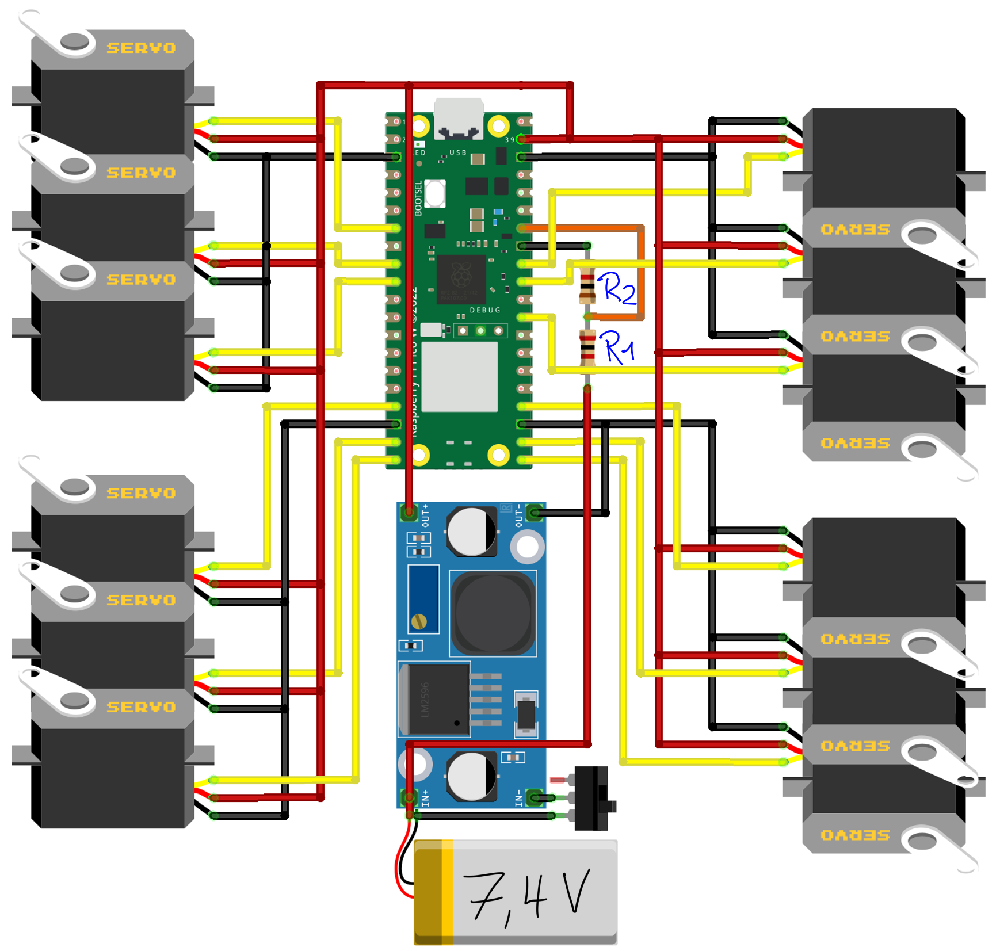
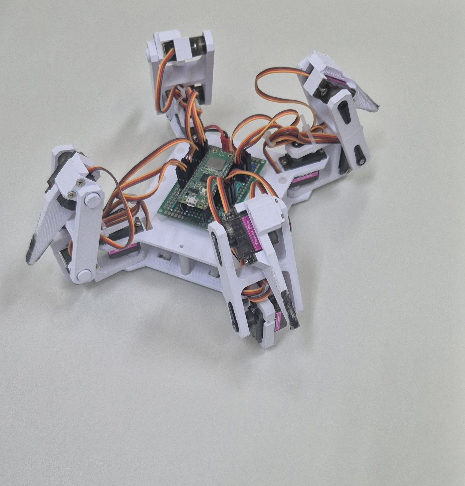
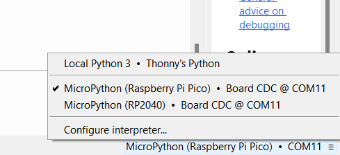

# Robô Quadrúpede Com 3 DOF Por Perna

## Componentes
Raspberry Pi Pico W  
12x Servomotores MG90S  
Conversor Step-Down  
Resistor 1k ohm  
Resistor 2k ohm  
Bateria Li-Ion 2s (7.4v) 2500 mAh  

## Circuito
Diagrama de circuito com as conexões dos componentes

R1 = 2R2 | Neste caso, R1 = 2k ohm e R2 = 1k ohm 

Soldar em uma perfboard

(A) Raspberry Removido; (B) Raspberry Adicionado

## Montagem
Imprimir modelos 3D da pasta Modelos_3d

Encaixar cabeçotes dos servos  

Encaixar servomotores e parafusar (4x) 

Encaixar Pernas nas bases e parafusar

Conectar todos os motores e bateria

## Programação
Conectar Raspberry no computador através de cabo usb  
Abrir o Thonny IDE  

Selecionar porta do Raspberry no canto inferior direito  

Fazer Upload dos arquivos para o Raspberry  
Executar código  
Conectar na rede Wi-Fi do robô (através de smartphone) 

Acessar o endereço 192.168.4.1 no browser web (através de smartphone) 

Controlar robô

## Vídeos do funcionamento
https://www.youtube.com/playlist?list=PLtiqwHhrwyDy4FeO3HXZ96Ta0Fswptasy
